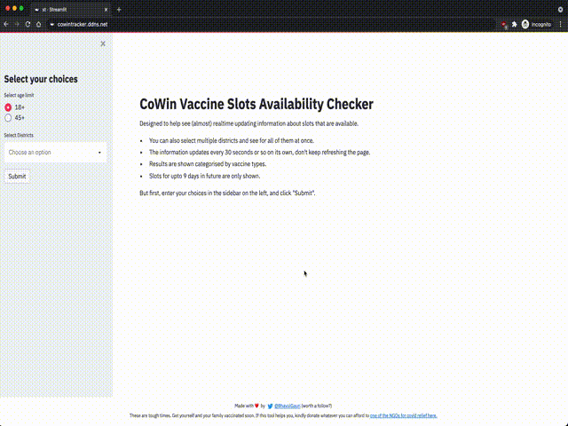

# CoWin Vaccine Slot Availability Checker




A small real-time system which keeps updating for available vaccinations slots given the choices of district (multiple districts supported) and age selected. The slots information gets auto-refreshed every 30 seconds so you don't have to move away or refresh the page yourself.   

- Shows slots categorised by vaccine type
- Heroku compatible repository (however API calls not working via Heroku)
- Uses CoWin Open APIs
- Only shows available slots so you don't get messy UI. Clean UI.
- Takes no data from the user :-)
- Intentionally does not let you automated booking or simple alerts, to prevent any one person getting advantage :-)

Remember you would have to still go to the CoWin website to actually book a slot. The website just takes the pain of constantly refreshing the actual website to check for availability and probably provides a slightly cleaner interface. So you don't need to squint your eyes to find a slot for yourself in official website.


## How is this made?

I used [Streamlit](https://streamlit.io) to build this app. Further this entire website is possible just because Govt. has opened the Availability checker APIs [here](https://apisetu.gov.in/public/api/cowin). 
 
Almost entire code relies in `app.py`


## How to run

```
1. Clone the repository
2. pip install -r requirements.txt
3. streamlit run app.py
```


## How is it deployed?

It is deployed currently on my personal GCP account. I've setup free domain from no-ip.com and   using LetsEncrypt for SSL. 


## Pull Requests welcome

The code quality can be improved quite a lot! Feel free to optimise, refactor and raise a PR. :) 

